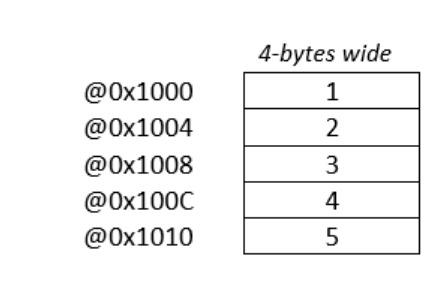

# 1. Big O notation
Big O notation is used to measure how **running time** or **space requirements** for the program grow as **input size grows**.

## 1.1 O(N) : Time = A n + B
E.g. Looping in for loop and calculate something for each index

## 1.2 O(1) : Time = A n0 + B
E.g. Summation function
### 1.2.1 Example 1 : Arrays 
Arrays are example for the constant time retrival of data. 

Nomrally, Int uses 4 bytes = 8bit X 4 = 1 Binary X 8 X 4 memory location. 

Hence finding the memory address is fixed time operation,

Memoery Location = FixedLocation + 4Byte (N)

Where, N is index of the sample stored in array.

## 1.3 O(N2) : Time = A n2 + B
Where, n = Number of samples

Rules for finding the Order:
  1. Keep fastest growing term
  2. Drop Constants

## 1.3 Complexities
### 1.3.1 Time Complexity : Measures running time growth
E.g. Binary Search Tree.. 1) Divide array in 2 parts, 2)discard one portion
Basically, BTree has time complexity O(N / 2k) but if we apply log 2 complexity can be described as O(log N)

### 1.3.2 Space Complexity : Measures space growth
