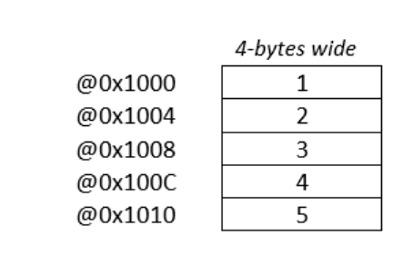
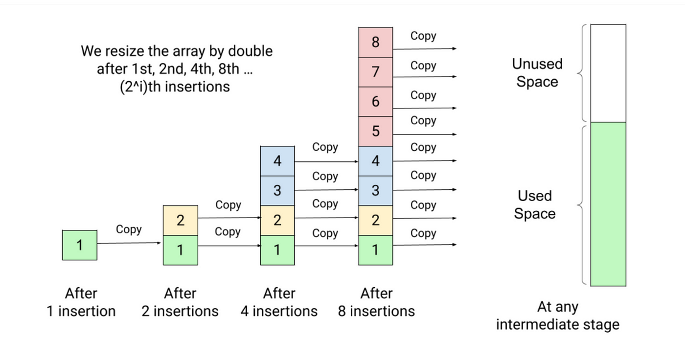

# 2. Arrays 
Arrays are example for the constant time retrival of data. 

Nomrally, Int uses 4 bytes = 8bit X 4 = 1 Binary X 8 X 4 memory location. 

Hence finding the memory address is fixed time operation,

Memoery Location = FixedLocation + 4Byte (N)

Where, N is index of the sample stored in array.

Operations and their time complexity in arrays,
  
  1. Find element on any index. : Complexity O(1)
  2. Find first element having specific value. : Compelxity O(N)
  3. Add/ Remove element on any index. : Compelxity O(N)
  4. Update element on any index. : Compelxity O(1)
  5. Printing All values in array. : Compelxity O(N)

## 2.1 Static Array

The Size/ length of an array is fixed. After creation of array, we can't change the Size/ length of an array.

## 2.2. Dynamic Array

The Size/ length of an array is not fixed. After creation of array, we can change the Size/ length of an array. When size of an array expands, the array copied to another memory location.

