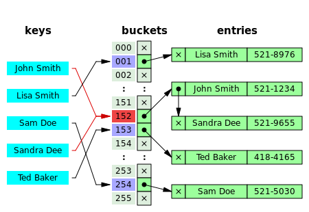
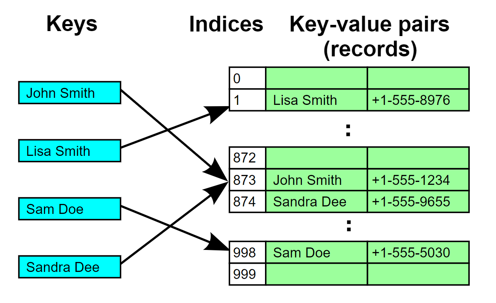

# 4. Hash Table

Basic Idea of Hash Table we can get for below mentioned image.

In above Example, Collision Resolution concept is mentioned. The Colission Resolution done in above image is using **Separate Chaining** method.

There is one more method for Collision Resolution named as Linear Probing. Following image explains the **Linear Probing**

Big O Analysis for ideal Hash Table & Linear Probing Case.
|  Operation            |  Complexity     |
|-----------------------|-----------------|
|  Lookup By Key        |  O(1)           |
|  Insertion            |  O(1)           |
|  Deletion             |  O(1)           |

For Separate Chaining(Linked List) Hash Table for worst case scenario.
|  Operation            |  Complexity     |
|-----------------------|-----------------|
|  Lookup By Key        |  O(N)           |
|  Insertion            |  O(N)           |
|  Deletion             |  O(N)           |