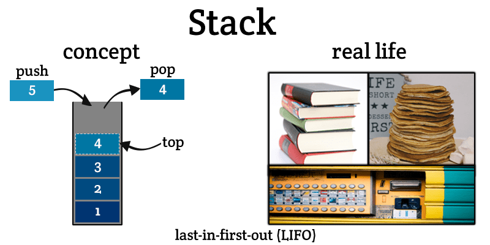

# 5. Stack or LIFO (Last In First Out)

The LIFO, we can understand using below image. Stack is used extensively in the undo functionality. In python, deque is an example of stack.

To avoid copying of elements from one memory location to other memory location in python list (Dynamic Array), Python has inbuilt class **collection.deque**. It's generic form of stack and queue. Moreover, It's extensively useful.