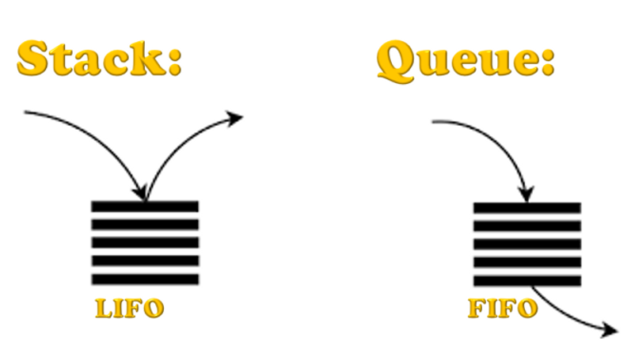

# 6. Queue or FIFO (First In First Out)

The FIFO, we can understand using below image. Queue is used extensively in sharing time series data or continues flow of data e.g. stock price data. In python List is an example of queue.

Difference between LIFO & FIFO can be understand by below image,

