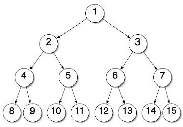
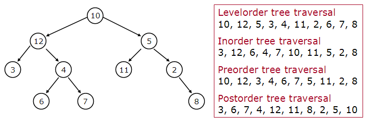

# 7. Tree

## 7.1 Terminology

Basic Terminology can be understand using below image,

- Root Node
- Parent Node
- Child Node
- Leaf Node or External Node : No child
- Ancestor of a Node : all element in path till root from a node
- Descendant of a Node : all element in path till leaf node from a node
- Sibling : Not a single child
- Level of a node
- Internal node (Atleast one child)
- Neighbour of a Node
- Subtree (E.g. Left SubTree, Right SubTree )
- Height of Tree

## 7.2 B-Tree or Binary Tree [ O(Log N) ]

Condition for B-Tree:
- Everynode has at most 2 child nodes (Left Child < Right Child)
- All the element must be unique

General Formula for Log N Complexity:
Log Sample_Reduction_Rate_Per_Ittration SampleCount = Ittration

## 7.2.1 Traversal Technique

## 7.2.1.1 Breadth First Seach

## 7.2.1.2 Depth First Seach

- In order Traversal : Print second(Binary) Visit 

  Extensively used to short the data and remove the duplicated entity. 

- Pre order Traversal : Print First Visit

- Post order Traversal : Print Last Visit

  