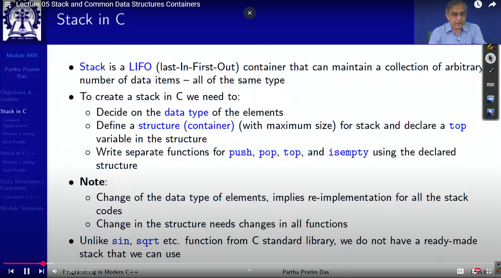

# L05: Stack and Common Data Structures Containers

## Stack in C



## Common use of Stack in C


## Program 05.01: Reversing a string

C
```C
#include <stdio.h>

typedef struct stack
{
    char data[100];
    int top;
} stack;

int empty(stack *p){ return ( p -> top == -1 ); }

int top(stack *p){ return ( p -> data[ p -> top ] ); }

int push(stack *p, char x){ 
    p -> data[ ++( p -> top ) ] = x ; 
}

int pop(stack *p){
    if (!empty(p))
        ( p -> top ) = ( p -> top ) - 1;
}

int main(){
    stack s;
    s.top = -1;

    char ch, str[10] = "ABCDE";
    int i, len = sizeof(str);

    for (i = 0; i < len; i++) {
        push(&s, str[i]);
    }
    
    printf("Reversed String: ");

    while (!empty(&s)) {
        printf("%c", top(&s));
        pop(&s);
    }
}

// Output : EDCBA
```

## Program 05.02: Postfix Expression Evaluation

C
```C
#include <stdio.h>

typedef struct stack
{
    char data[100];
    int top;
} stack;

int empty(stack *p){ return ( p -> top == -1 ); }

int top(stack *p){ return ( p -> data[ p -> top ] ); }

int push(stack *p, char x){ 
    p -> data[ ++( p -> top ) ] = x ; 
}

int pop(stack *p){
    if (!empty(p))
        ( p -> top ) = ( p -> top ) - 1;
}

int main(){
    stack s;
    s.top = -1;

    // PostFix Expression: 1 2 3 * + 4 -
    char postfix[] = {'1', '2', '3', '*', '+', '4', '-'};

    for (int i = 0; i < 7; i++) {
        char ch = postfix[i];

        if (isdigit(ch)) push(&s, ch-'0');
        else{
            int op2 = top(&s); pop(&s);
            int op1 = top(&s); pop(&s);
            switch (ch)
            {
            case '+': push(&s, op1 + op2); break;
            case '-': push(&s, op1 - op2); break;
            case '*': push(&s, op1 * op2); break;
            case '/': push(&s, op1 / op2); break;
            }
        }
        
        printf("Evaluation %d", top(&s));
    }
    
}

// Output : 3
```

## Stack in C++

C++ Standard library provide a ready-made stack for any type of elements

To Create a stack in c++ we need to:
- Include a stack header
- Instantiate a stack with proper element type(like char)
- Use the functions of the stack objects for stack operations

## Program 05.03: Reversing a string in C++

C++
```C
#include <iostream>
#include <cstring>
#include <stack>

using namespace std;

int main(){
    char str[10] = "ABCDE";
    stack<char> s; // Stack Class

    for (int i = 0; i < strlen(str); i++)
        s.push(str[i]);
    
    cout << "Reversed String: " ;

    while (!s.empty()) {
        cout << s.top(); s.pop();
    }
}
// Output : EDCBA
```

## Program 05.04: Postfix Evaluation in C++

```C
#include <iostream>
#include <cstring>
#include <stack>

using namespace std;

int main(){
    char postfix[] = {'1', '2', '3', '*', '+', '4', '-'};
    
    stack<int> s; // Stack Class
    
    for (int i = 0; i < 7; i++) {
        char ch = postfix[i];

        if (isdigit(ch)) s.push(ch-'0');
        else{
            int op2 = s.top(); s.pop();
            int op1 = s.top(); s.pop();
            switch (ch)
            {
            case '+': s.push(op1 + op2); break;
            case '-': s.push(op1 - op2); break;
            case '*': s.push(op1 * op2); break;
            case '/': s.push(op1 / op2); break;
            }
        }
        
        cout << "Evaluation " << s.top();
    }
}
```

## Data Structures/ Containers in C++


## Module Summary

- In C, stack needs to be coded by the user and works for a specific type of elements only.
- C++ standard library provides ready-made stack. It works like a data type
- There are several containers in c++ standard library